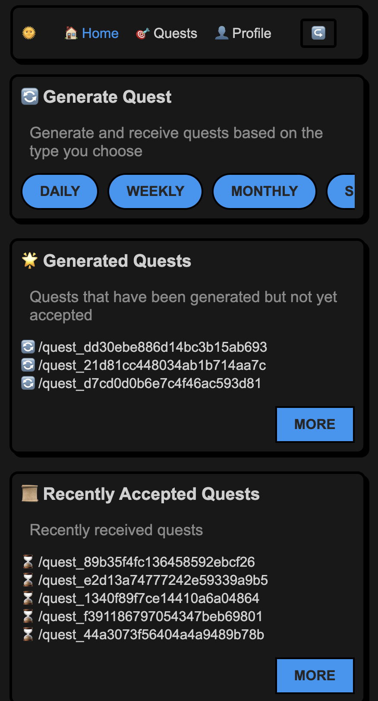
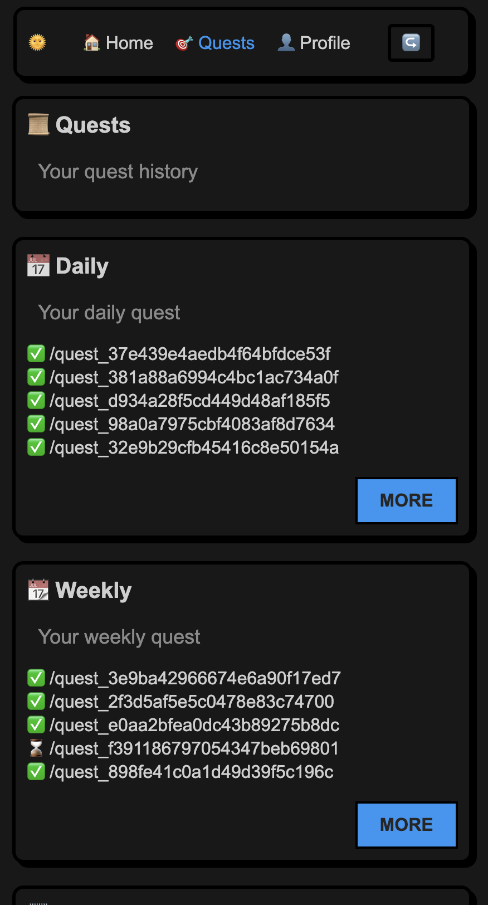
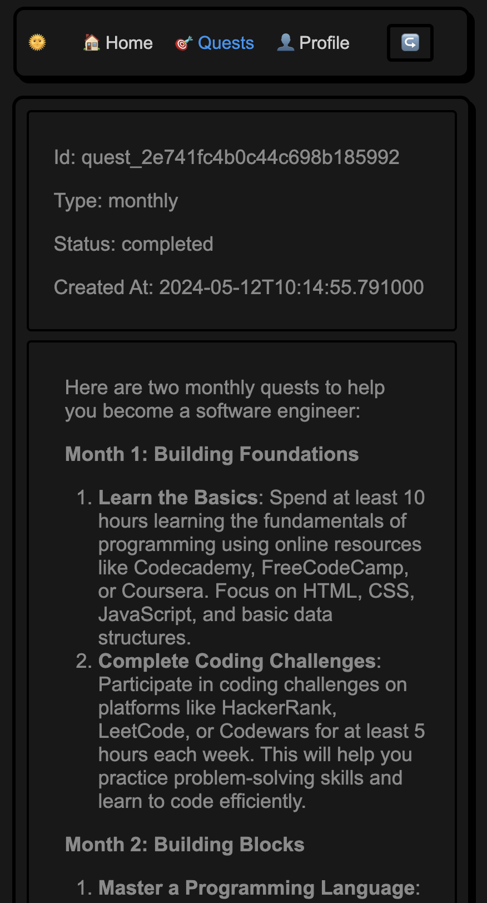
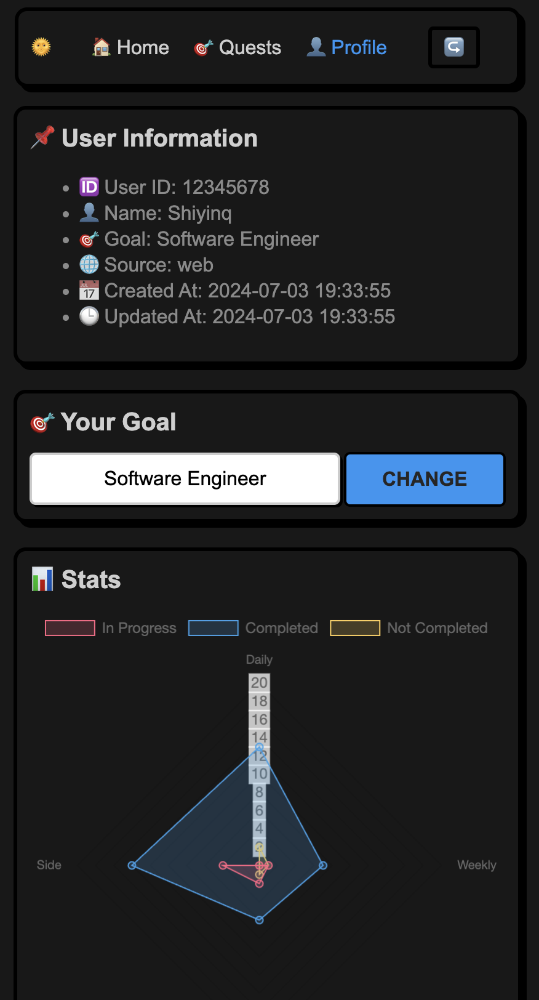
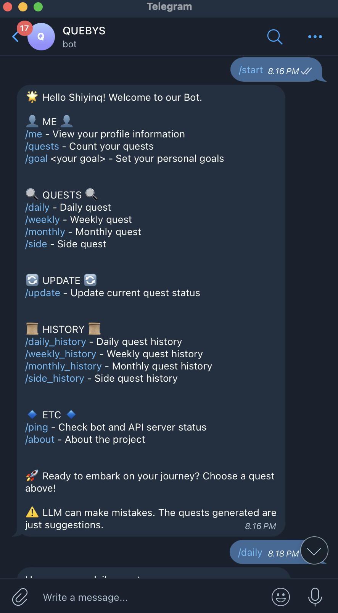
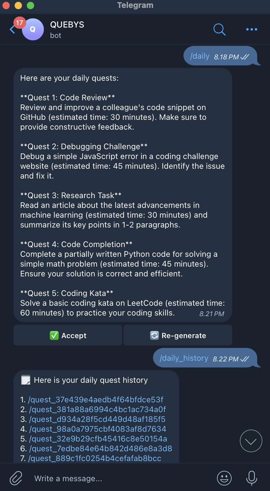
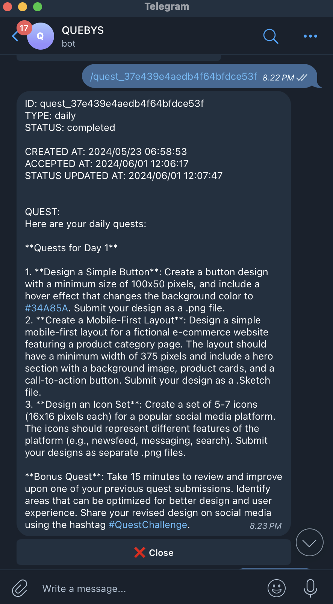
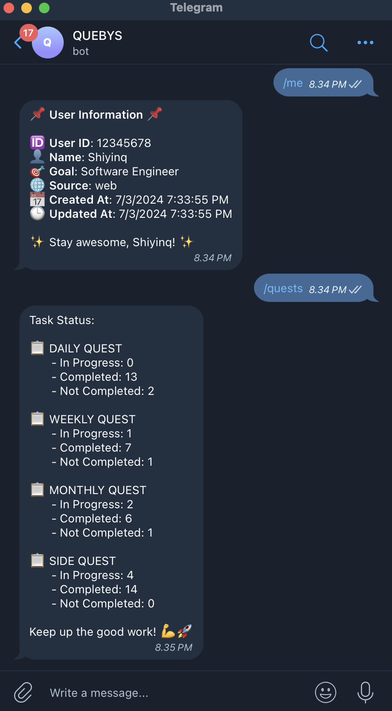

# QUEBYS - QUEST BY SYSTEM
[](https://github.com/Shiyinq/quest-by-system)


|  |  |  |  |
|:---:|:---:|:---:|:---:|

|  |  |  |  |
|:---:|:---:|:---:|:---:|

Sometimes we get confused about what to do today. For example, I'm a software engineer who often gets confused about how to fill my free time. As a result, my days are filled with sleeping or playing games. Therefore, this casual project was created. You will be given quests by an open-source LLM powered by Ollama, so you have references on what to do, for instance, as a software engineer. In short, just like in an MMORPG game, you will be given quests by the system.

## Table of Contents
- [QUEBYS - QUEST BY SYSTEM](#quebys---quest-by-system)
  - [Table of Contents](#table-of-contents)
  - [Requirements](#requirements)
  - [Getting Started with Docker](#getting-started-with-docker)
  - [Development](#development)
    - [Run the backend](#run-the-backend)
    - [Run the frontend and telegram bot](#run-the-frontend-and-telegram-bot)
    - [Contributing](#contributing)


## Requirements
- Python v3.9.12 ~
- MongoDB  v5.0
- Ollama latest version
- Docker latest version

## Getting Started with Docker

Before you begin, ensure you have [Docker](https://docs.docker.com/engine/install/) installed.

**1. Clone the repository**
```bash
git clone https://github.com/Shiyinq/quest-by-system.git
cd quest-by-system
```

**2. Create environment files**

For the backend:
```bash
cp .env.example .env
```

For the frontend:
```bash
cd client/web
cp .env.example .env
cd ..
```

Fort the bot:
```bash
cd client/telegram-bot
cp .env.example .env
cd ../../
```

Open each `.env` file you have created and update the values as needed.

**3. Build and run the Docker containers**
```bash
docker compose up --build -d
```
Wait a few minutes for the setup to complete. You can then access:
- Frontend at http://localhost:5000
- Backend at http://localhost:8000
- Telegram Bot at http://localhost:5050

## Development
### Run the backend
Make sure you have [Ollama](https://ollama.com/)  installed and at least one model downloaded from Ollama. For a better experience, use the model `llama3:instruct`.

After that, you can follow this instructions.

**1. Clone this repository**
```bash
git clone https://github.com/Shiyinq/quest-by-system.git
```
**2. Navigate to the project directory**
```bash
cd quest-by-system
```
**3. Create python environment**

You can use any Python environment like conda or others, but I am using venv.

create environment
```bash
python -m venv .venv
```
activate environment
```bash
source .venv/bin/activate
```
**4. Install dependencies**
```bash
pip install -r requirements/base.txt
```
**5. Create .env file**
```bash
cp .env.example .env
```
**6. Make sure you have created a MongoDB database** 

The default `DB_NAME` is `quest`, but you can change it in the `.env` file.

**7. Running the project**
```bash
sh scripts/start-dev.sh  
```
Open API Docs
 ```bash
 http://localhost:5000/docs
 ```

### Run the frontend and telegram bot
You can use the [API](http://localhost:5000/docs) to create your own client, but we already have clients available for you to try: a Telegram Bot and a Web client.

Documentation for the Telegram Bot and Web client is provided.
- [Web](./client/web/README.md)
- [Telegram Bot](./client/telegram-bot/README.md)

### Contributing
- You can open [issues](https://github.com/Shiyinq/quest-by-system/issues) to report bugs or request features.
- You can fix bugs and add features on your own.
  1. Fork this repository
  2. Create a feature branch `git checkout -b new-feature`
  3. Commit your changes `git commit -m 'Add new feature'`
  4. Push to the branch `git push origin new-feature`
  5. Create a Pull Request
   