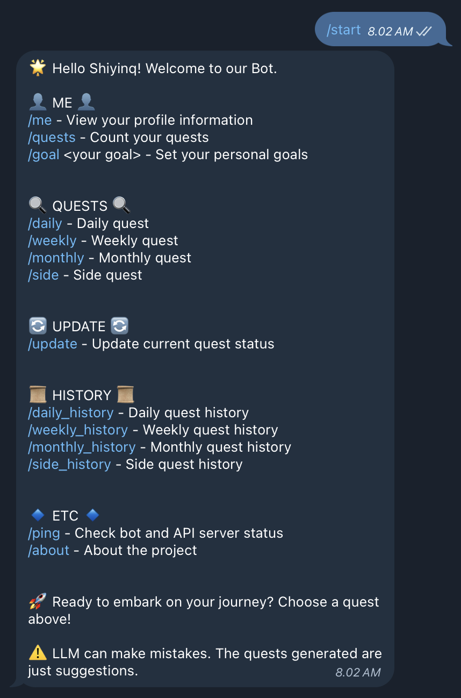

# QUEBYS - BOT

This bot allows you to generate quests and much more using text-based specific commands.



## Table of Contents
- [QUEBYS - BOT](#quebys---bot)
  - [Table of Contents](#table-of-contents)
  - [Requirements](#requirements)
  - [Installation](#installation)
  - [Usage](#usage)
  - [Debug](#debug)
  - [Contributing](#contributing)


## Requirements
- Node JS v20.10.0
- NPM v10.2.3
- nodemon lates

## Installation
Steps to install this project.

1. Clone this repository
    ```bash
    git clone https://github.com/Shiyinq/quest-by-system.git
    ```
2. Navigate to the project directory:
    ```bash
    cd quest-by-system/client/telegram-bot
    ```
3. Install dependencies:
    ```bash
    npm install
    ```

## Usage
Steps to run the bot after installation.
1. Run the Backend [README](/README.md)
2. Create `.env` file
    ```base
        cp .env.example .env
    ```
3. Fill the `BOT_TOKEN` you can get token from [@BotFather](https://t.me/botfather)
4. Run the bot script:
    ```bash
    npm run dev
    ```

## Debug
You can open `logs` folder to see the error and on your own terminal.

## Contributing
- You can open issues to report bugs or request features.
- You can fix bugs and add features on your own.
  1. Fork this repository
  2. Create a feature branch `git checkout -b new-feature`
  3. Commit your changes `git commit -m 'Add new feature'`
  4. Push to the branch `git push origin new-feature`
  5. Create a Pull Request
